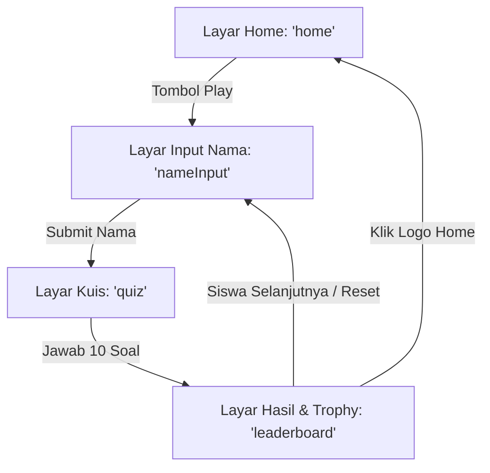

# Dokumen Analisis Proyek: "Wise Gadget Guide" (Game Animasi Interaktif)

Dokumen ini disusun khusus sebagai acuan bagi Claude (atau model AI lainnya) untuk melakukan analisis mendalam terhadap proyek media interaktif ini, guna menyusun **Bab 4 (Hasil dan Pembahasan / Implementasi dan Pengujian)** pada dokumen skripsi.

---

## 1. Profil Proyek

*   **Nama Aplikasi:** *Wise Gadget Guide* (Game Edukasi Menggunakan Gadget dengan Bijak).
*   **Target Pengguna:** Anak-anak usia dini hingga sekolah dasar (TK/SD), orang tua, dan guru.
*   **Tujuan Proyek:** Memberikan edukasi interaktif mengenai aturan, batasan, posisi tubuh yang benar, dan keamanan digital saat menggunakan gadget secara mandiri maupun didampingi orang tua.
*   **Teknologi Utama (Tech Stack):**
    *   **Runtime Desktop:** Electron (v31.0.1) untuk membungkus aplikasi web menjadi aplikasi desktop portabel (`.exe`).
    *   **Framework Frontend:** React (v18.3.1) untuk manajemen state antarmuka yang reaktif.
    *   **Build Tool & Dev Server:** Vite (v5.3.1) untuk proses bundling yang cepat.
    *   **Desain & Styling:** Tailwind CSS (v3.4.4) dikombinasikan dengan PostCSS & Autoprefixer untuk styling modern.
    *   **Desain Visual & Tema:** Tema kartun neo-brutalisme dengan garis tepi hitam tegas (*thick border*) dan bayangan retro (*tactile shadow*), palet warna cerah (kuning, oranye, biru, merah muda), serta animasi mikro agar menarik bagi anak-anak.

---

## 2. Struktur Proyek dan File

Aplikasi ini memiliki struktur folder sebagai berikut:

```text
media-interaktif/
├── assets_skripsi/         # Aset mentah gambar dan prototipe HTML awal untuk dokumentasi
├── dist/                   # Hasil build web kompilasi Vite (HTML, JS, CSS, Aset)
├── dist-electron/          # Hasil kompilasi installer Electron (.exe)
├── electron/               # Konfigurasi Electron Main Process
│   ├── main.js             # Entry point utama Electron (Window size 1280x720, aspect ratio 16:9)
│   └── preload.js          # Skrip preload untuk keamanan dan isolasi konteks
├── src/                    # Source code React utama
│   ├── assets/             # Aset gambar & audio latar permainan
│   ├── App.jsx             # Berisi seluruh komponen visual, logika game, state, dan modal (41 KB)
│   ├── index.css           # Kumpulan utility, CSS layer, custom class neo-brutalis, & keyframe animasi
│   └── main.jsx            # Entry point React untuk rendering ke DOM
├── index.html              # Template HTML utama
├── package.json            # Konfigurasi dependensi Node.js & skrip build
├── tailwind.config.js      # Konfigurasi kustomisasi tema Tailwind CSS
└── vite.config.js          # Konfigurasi Vite compiler
```

---

## 3. Alur Permainan & Logika Navigasi (*State Machine*)

Aplikasi menggunakan pendekatan *Single Page Application* (SPA) dengan navigasi berbasis state `screen` di dalam [App.jsx](file:///d:/ORIJECT%20MEDIA%20INTERSAKTID%20SKRIPSIIIIII/media-interaktif/src/App.jsx). Alur layar utama didefinisikan oleh nilai string state `screen`:



### Detail Fungsionalitas Setiap Layar:

1.  **Layar Utama (Home - `screen === 'home'`):**
    *   Menampilkan judul animasi "Ayo Bijak! 🎮 Menggunakan Gadget".
    *   Dekorasi awan bergerak, bintang mengambang, efek partikel, dan tombol *Play* berbentuk lingkaran kartun dengan denyut visual (*glow pulse*).
    *   Terdapat tombol kontrol audio di bagian pojok kanan atas untuk mematikan/menyalakan musik latar (*background music*).
2.  **Layar Input Nama (`screen === 'nameInput'`):**
    *   Formulir teks interaktif dengan ikon pensil untuk memasukkan nama siswa (maksimal 15 karakter).
    *   Tombol "MULAI! 🚀" yang dinonaktifkan (disabled) jika input nama masih kosong.
    *   Begitu disubmit, sistem akan mengacak soal dan pilihan jawaban menggunakan algoritma pengacakan, lalu memulai kuis.
3.  **Layar Kuis (`screen === 'quiz'`):**
    *   Menampilkan indikator kemajuan berupa *progress bar* kartun bertema warna gradasi oranye-kuning yang dinamis sesuai jumlah soal yang telah dikerjakan.
    *   Menampilkan pertanyaan kuis di dalam kartu bergaya komik.
    *   Menampilkan 2 pilihan jawaban (Pilihan A berwarna biru dengan gradasi linier, Pilihan B berwarna pink/merah dengan gradasi linier). Masing-masing pilihan memiliki ikon representatif (Material Symbols) yang membantu pemahaman visual anak.
    *   Menampilkan **Modal Umpan Balik (Feedback Modal)** instan setelah anak memilih jawaban:
        *   **Umpan Balik Benar (Correct Feedback):** Muncul pop-up animasi *ScaleUp* dengan warna hijau, emoji terompet pesta (🎉), suara bel gembira, serta teks edukasi positif yang menjelaskan mengapa jawaban tersebut benar.
        *   **Umpan Balik Salah (Wrong Feedback):** Muncul pop-up animasi *ScaleUp* berwarna oranye, emoji lampu ide (💡), suara peringatan lembut, serta teks koreksi yang memberi arahan ramah anak.
4.  **Layar Peringkat & Skor Akhir (Leaderboard - `screen === 'leaderboard'`):**
    *   Menampilkan kartu skor siswa (misalnya: `8/10`) dengan evaluasi pesan dinamis (skor $\ge 8$: "🌟 Selamat! Kamu hebat!", skor $\ge 5$: "👍 Bagus! Terus belajar!", skor $< 5$: "💪 Tetap semangat!").
    *   Diiringi animasi efek hujan konfeti (*confetti falls*) warna-warni yang turun dari atas layar secara terus-menerus.
    *   Menampilkan daftar peringkat (*Leaderboard*) lokal dari siswa-siswa yang telah bermain. Baris nama siswa yang aktif ditandai khusus dengan latar belakang kuning terang, bingkai tebal, dan teks "(Kamu)".
    *   Menyediakan tombol "Siswa Selanjutnya" untuk me-reset state internal dan kembali ke layar input nama agar siswa lain bisa mencoba secara bergantian di komputer yang sama.

---

## 4. Mekanisme Algoritma Pengacakan (Fisher-Yates Shuffle)

Untuk memastikan keadilan uji coba dan variasi dalam sesi pembelajaran mandiri, soal-soal dan posisi pilihan jawaban diacak secara dinamis untuk setiap siswa baru.

Algoritma yang digunakan adalah **Fisher-Yates Shuffle** yang diimplementasikan dalam baris kode [App.jsx:L7-L29](file:///d:/ORIJECT%20MEDIA%20INTERSAKTID%20SKRIPSIIIIII/media-interaktif/src/App.jsx#L7-L29):

```javascript
// Algoritma Fisher-Yates Shuffle untuk pembagian seragam
const shuffleArray = (array) => {
  const arr = [...array];
  for (let i = arr.length - 1; i > 0; i--) {
    const j = Math.floor(Math.random() * (i + 1));
    [arr[i], arr[j]] = [arr[j], arr[i]];
  }
  return arr;
};

// Menyiapkan kumpulan soal sesi belajar siswa
const prepareSessionQuestions = () => {
  const shuffledQuestions = shuffleArray(QUESTIONS);
  return shuffledQuestions.map((q) => {
    const choices = [
      { text: q.optionA, isCorrect: true, icon: q.iconA },
      { text: q.optionB, isCorrect: false, icon: q.iconB }
    ];
    return {
      ...q,
      choices: shuffleArray(choices) // Pilihan A & B diacak posisinya agar tidak selalu statis
    };
  });
};
```

### Keunggulan Metode Ini:
1.  **Mencegah Efek Hafalan Mekanis:** Siswa tidak bisa hanya menghafal posisi tombol (misalnya, menekan "A" terus-menerus) karena susunan soal maupun letak pilihan jawaban diacak ulang di setiap sesi baru.
2.  **Distribusi Seragam:** Setiap soal memiliki peluang yang sama besar untuk muncul di nomor awal atau nomor akhir.

---

## 5. Bank Soal & Muatan Edukasi (Educational Content)

Terdapat 10 butir pertanyaan edukatif berbahasa Indonesia yang dirancang ramah anak:

| ID | Pertanyaan Kuis | Jawaban Benar (Option A) | Jawaban Salah (Option B) | Pesan Edukasi Benar / Salah |
| :--- | :--- | :--- | :--- | :--- |
| **1** | Saat waktu belajar di kelas atau di rumah, apa yang harus kita lakukan? | Fokus belajar dan menyimpan gadget | Bermain game di gadget diam-diam | **Benar:** Hebat! Kamu Benar! Belajar itu seru dan membuat kita jadi lebih pintar.<br>**Salah:** Oops! Gadget dimainkan nanti saja setelah belajar selesai ya. |
| **2** | Berapa lama waktu maksimal bermain gadget dalam sehari untuk anak-anak? | Maksimal 1 hingga 2 jam saja | Bebas bermain seharian sampai malam | **Benar:** Keren! Membatasi waktu main gadget menjaga tubuh kita tetap sehat.<br>**Salah:** Kurang tepat. Terlalu lama bermain gadget bisa membuat mata lelah dan pusing. |
| **3** | Apa yang harus dilakukan jika mata terasa lelah atau perih saat menggunakan gadget? | Istirahat dan melihat benda atau pemandangan jauh | Terus bermain sambil mengucek-ngucek mata | **Benar:** Bagus sekali! Istirahatkan matamu agar tetap sehat dan segar.<br>**Salah:** Aduh, mengucek mata saat lelah bisa membuatnya merah dan iritasi. |
| **4** | Kapan waktu yang paling penting untuk TIDAK menggunakan gadget sama sekali? | Saat makan bersama keluarga dan menjelang tidur malam | Kapan saja bebas sesuka hati kita tanpa aturan | **Benar:** Tepat! Makan bersama keluarga dan tidur malam lebih penting untuk kesehatan.<br>**Salah:** Bermain gadget saat makan atau sebelum tidur bisa mengganggu pencernaan dan tidurmu. |
| **5** | Sebelum memasang (mengunduh) game baru di gadget, apa yang harus kamu lakukan? | Meminta izin orang tua atau guru terlebih dahulu | Langsung unduh sendiri tanpa memberi tahu siapa pun | **Benar:** Pintar! Orang tua harus tahu apa yang kamu pasang agar aman.<br>**Salah:** Hati-hati! Beberapa game tidak cocok untuk anak-anak dan bisa berbahaya. |
| **6** | Bagaimana posisi duduk yang baik saat menggunakan gadget? | Duduk tegak dengan jarak layar minimal 30 cm | Tiduran tengkurap sangat dekat dengan layar | **Benar:** Hebat! Duduk tegak menjaga tulang punggung dan matamu tetap sehat.<br>**Salah:** Tiduran sambil bermain gadget bisa membuat mata cepat rusak dan punggung pegal. |
| **7** | Jika ada orang tidak dikenal mengajak mengobrol di game online, apa tindakanmu? | Segera melapor ke orang tua atau guru | Membalas dan memberikan nama lengkap serta alamat rumah | **Benar:** Luar biasa! Selalu jaga keamanan datamu dengan melapor ke orang dewasa.<br>**Salah:** Bahaya! Jangan pernah memberikan informasi pribadi kepada orang asing di internet. |
| **8** | Apa yang sebaiknya dilakukan saat teman datang ke rumah untuk bermain? | Menaruh gadget dan bermain bersama teman dengan ceria | Masing-masing sibuk bermain game di gadget sendiri | **Benar:** Keren! Bermain bersama teman jauh lebih menyenangkan secara langsung.<br>**Salah:** Sayang sekali, nanti temanmu merasa diabaikan dan bosan. |
| **9** | Mengapa kita dilarang bermain gadget di ruangan yang gelap? | Cahaya layar di ruangan gelap dapat merusak mata kita | Supaya baterai gadget tidak cepat habis dan hemat | **Benar:** Benar! Menatap layar terang di tempat gelap sangat berbahaya bagi mata.<br>**Salah:** Kesehatan matamu jauh lebih penting daripada sekadar baterai gadget. |
| **10** | Apa kegunaan gadget yang paling baik untuk mendukung kegiatan belajarmu? | Mencari informasi materi pelajaran sekolah yang bermanfaat | Menonton video hiburan terus-menerus tanpa henti | **Benar:** Luar biasa! Gadget adalah alat belajar yang hebat jika digunakan dengan bijak.<br>**Salah:** Boleh menonton hiburan, tapi jangan sampai lupa waktu dan mengabaikan belajar. |

---

## 6. Detail Desain UI/UX & Animasi Mikro

Visual dari aplikasi ini dirancang secara matang dengan token desain khusus di [src/index.css](file:///d:/ORIJECT%20MEDIA%20INTERSAKTID%20SKRIPSIIIIII/media-interaktif/src/index.css):

### A. Tipografi (Google Fonts)
*   **Lilita One (Cursive):** Digunakan untuk teks judul, nama menu, tajuk modal, dan angka skor. Karakteristik hurufnya tebal, membulat (*chubby*), dan memberikan kesan ramah anak-anak.
*   **Nunito (Weight 400 s.d. 900):** Digunakan untuk teks deskripsi, tombol pilihan ganda, dan instruksi menu. Tipografi ini sangat mudah dibaca oleh anak-anak yang baru belajar membaca karena bentuk lengkungannya yang lembut.

### B. Palet Warna (Color System)
*   `#FFD600` (Kuning Terang): Warna utama untuk elemen penarik perhatian, ikon bintang, dan tombol aktif.
*   `#FF6B35` (Oranye Kartun): Memberikan kesan antusiasme dan ceria, digunakan untuk judul sekunder, header logo, dan feedback salah.
*   `#4CAF50` (Hijau Edukatif): Digunakan untuk tombol sukses, modal jawaban benar, dan aksi lanjut.
*   `#1a8fd1` s.d `#5ec2f5` (Gradasi Biru): Digunakan untuk tombol pilihan jawaban A.
*   `#e8275e` s.d `#ff8fb5` (Gradasi Pink/Merah): Digunakan untuk tombol pilihan jawaban B.
*   `#1a1a1a` (Hitam Pekat): Digunakan sebagai garis batas tebal (*thick borders*) berukuran `4px` hingga `6px` untuk menonjolkan estetika komik.

### C. Animasi Mikro & Interaktivitas
*   **Mengambang (`float-anim` & `soft-floating`):** Digunakan pada elemen awan dan emoji beruang dekoratif agar antarmuka tidak terasa kaku.
*   **Goyangan (`wobble-anim`):** Efek rotasi kecil berulang pada bintang dekorasi untuk memancing fokus anak.
*   **Putaran Lambat (`spin-slow`):** Digunakan pada roda gir atau bintang di latar belakang.
*   **Denyutan Cahaya (`glow-pulse`):** Berfungsi sebagai penunjuk visual utama agar anak mengetahui bagian mana yang harus ditekan (misal: tombol Play).
*   **Pop-up Elastis (`animate-scaleUp`):** Menggunakan efek kurva bezier elastis (`cubic-bezier(0.34, 1.56, 0.64, 1)`) untuk memunculkan modal umpan balik secara mengejutkan tetapi menyenangkan.

---

## 7. Panel Pengaturan & Manajemen Sistem

Untuk mendukung pengujian sistem (*Usability & Settings*), aplikasi menyediakan panel pengaturan (Settings Modal) yang dapat diakses melalui ikon roda gerigi di header:
1.  **Kontrol Suara Efek (SFX):** Mengaktifkan atau menonaktifkan efek suara tepuk tangan/bel saat anak menjawab kuis atau mengeklik tombol.
2.  **Kontrol Musik Latar (BGM):** Mengatur pemutaran musik latar anak-anak secara global.
3.  **Reset Leaderboard:** Fitur pengembang/guru untuk menghapus basis data leaderboard lokal. Menghadirkan sub-modal konfirmasi ("Apakah kamu yakin?") dan sub-modal sukses ("Berhasil!") untuk mencegah penghapusan data secara tidak sengaja.

---

## 8. Panduan Menyusun Bab 4 Skripsi Menggunakan Dokumen Ini

Claude dapat langsung memanfaatkan informasi di atas untuk membagi pembahasan Bab 4 menjadi beberapa subbab standar skripsi teknologi/multimedia:

### Subbab 4.1: Implementasi Sistem (Realisasi Desain)
*   *Panduan:* Bandingkan desain prototipe awal yang ada di folder [assets_skripsi](file:///d:/ORIJECT%20MEDIA%20INTERSAKTID%20SKRIPSIIIIII/media-interaktif/assets_skripsi) (misal: `halaman_utama_screen.png`, `input_nama_screen.png`) dengan hasil akhir kode di [App.jsx](file:///d:/ORIJECT%20MEDIA%20INTERSAKTID%20SKRIPSIIIIII/media-interaktif/src/App.jsx). Tuliskan bahwa realisasi antarmuka telah berhasil diselesaikan menggunakan kombinasi Electron dan React.

### Subbab 4.2: Pembahasan Logika Program & Algoritma
*   *Panduan:* Jelaskan logika pengacakan soal menggunakan Algoritma **Fisher-Yates Shuffle**. Sertakan potongan kode dari [App.jsx:L7-L29](file:///d:/ORIJECT%20MEDIA%20INTERSAKTID%20SKRIPSIIIIII/media-interaktif/src/App.jsx#L7-L29) dan jelaskan diagram alur (*flowchart*) bagaimana data dialirkan dari state `studentName` hingga kalkulasi `score` akhir yang masuk ke tabel `leaderboard`.

### Subbab 4.3: Pembahasan Aspek UI/UX dan Multimedia
*   *Panduan:* Bahas elemen-elemen multimedia yang diimplementasikan:
    *   **Teks:** Penggunaan font *Lilita One* dan *Nunito* dari Google Fonts.
    *   **Gambar:** Background bergaya taman kanak-kanak (`cute_kindergarten_bg.png`) dan ikon interaktif.
    *   **Audio:** Integrasi musik latar loopable Kevin MacLeod ("Carefree") dan efek suara interaktif.
    *   **Animasi:** Efek translasi awan, animasi elastis modal umpan balik, dan animasi partikel konfeti.

### Subbab 4.4: Hasil Pengujian Aplikasi (Testing)
*   *Panduan:* Buat tabel pengujian fungsionalitas menggunakan metode **Black-Box Testing**.
    *   *Skenario Pengujian:*
        1.  Menjalankan aplikasi pertama kali $\rightarrow$ musik latar menyala otomatis (berhasil melompati kebijakan autoplay browser lewat event listener interaksi user).
        2.  Membiarkan input nama kosong lalu mengeklik tombol mulai $\rightarrow$ tombol terkunci/mati (sesuai harapan).
        3.  Mengisi nama dan menekan submit $\rightarrow$ kuis berjalan, soal diacak secara acak (sesuai harapan).
        4.  Memilih jawaban A atau B $\rightarrow$ memicu modal umpan balik instan beserta bunyi SFX pendukung (sesuai harapan).
        5.  Mengerjakan kuis hingga selesai $\rightarrow$ skor terekam dan muncul di urutan leaderboard lokal yang sesuai (sesuai harapan).
        6.  Membuka modal pengaturan, mematikan audio, lalu menjawab $\rightarrow$ suara tidak terdengar (sesuai harapan).
        7.  Mengeklik tombol "Reset Leaderboard" di pengaturan $\rightarrow$ memicu konfirmasi dan berhasil mengosongkan tabel (sesuai harapan).
